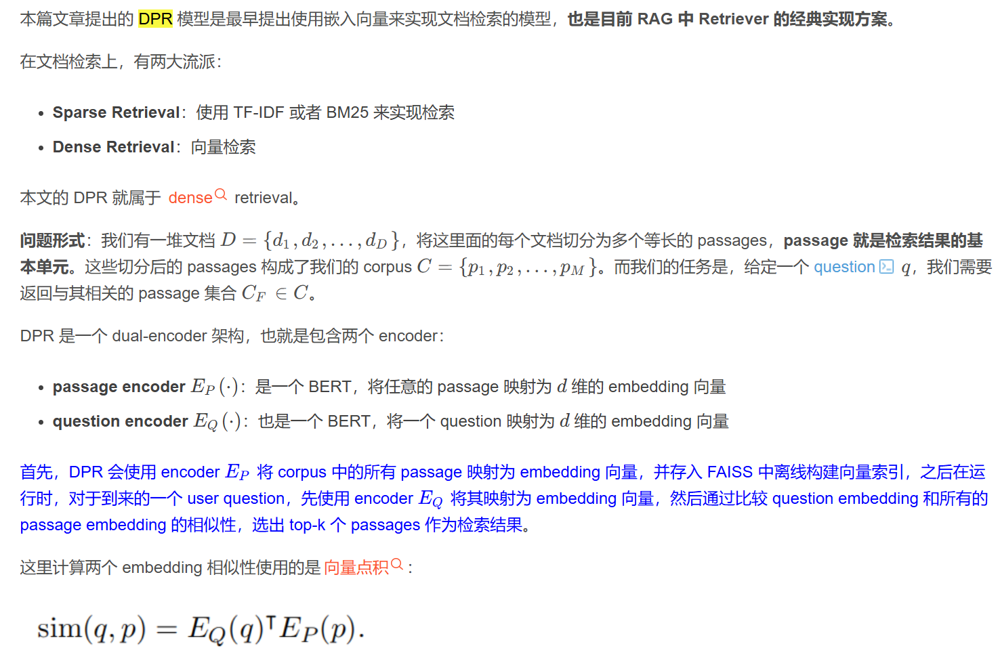
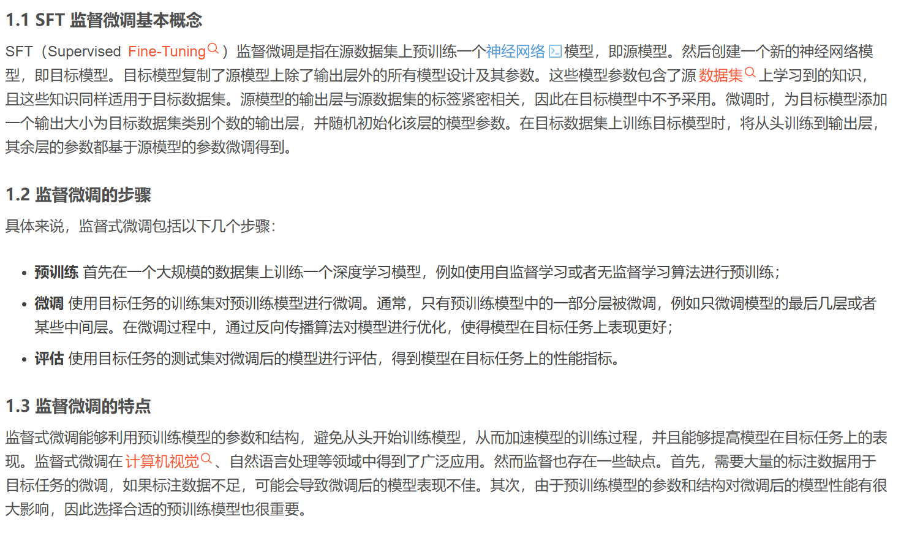
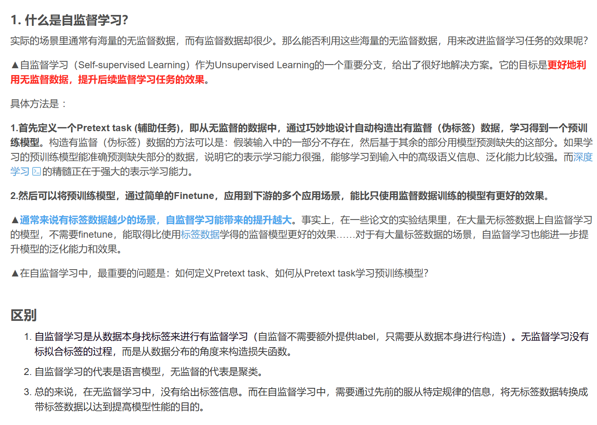

+++ 
author = "Husky"
title = "知识整理"
date = "2025-01-12"
categories = [
    "Blog"
]
+++
### BERT

- BERT 利用基于 Transformer 的神经网络来理解和生成类似人类的语言。BERT 采用仅编码器的架构。在原始 Transformer 架构中，既有编码器模块，也有解码器模块。在 BERT 中使用仅编码器架构的决定表明主要强调理解输入序列而不是生成输出序列。  
- 传统语言模型按顺序处理文本，从左到右或从右到左。这种方法将模型的感知限制在目标词之前的直接上下文中。BERT 使用双向方法（B 就是 Bidirectional（双向）），同时考虑句子中单词的左右上下文，而不是按顺序分析文本，BERT 同时查看句子中的所有单词。例如：“The bank is situated on the _______ of the river.”在单向模型中，对空白的理解将严重依赖于前面的单词，并且模型可能难以辨别“bank”是指银行还是河的一侧。BERT 是双向的，它同时考虑左侧（“The bank is situated on the”）和右侧上下文（“of the river”），从而实现更细致的理解。它理解缺失的单词可能与银行的地理位置有关，展示了双向方法带来的语境丰富性。
- BERT 模型经历了两个步骤：
  1. 对大量未标记的文本进行预训练，以学习上下文嵌入。
  2. 对标记数据进行微调，以执行特定的 NLP 任务。

### 前馈神经网络

- 前馈神经网络中，把每个神经元按接收信息的先后分为不同的组，每一组可以看做是一个神经层。每一层中的神经元接收前一层神经元的输出，并输出到下一层神经元。整个网络中的信息是朝着一个方向传播的，没有反向的信息传播（和误差反向传播不是一回事），可以用一个有向无环图来表示。
- 前馈神经网络包括全连接前馈神经网络和卷积神经网络。
- 前馈神经网络可以看做是一个函数，通过简单非线性函数的多次复合，实现输入空间到输出空间的复杂映射。

### 反馈神经网络

- 反馈神经网络中神经元不但可以接收其他神经元的信号，而且可以接收自己的反馈信号。和前馈神经网络相比，反馈神经网络中的神经元具有记忆功能，在不同时刻具有不同的状态。反馈神经网络中的信息传播可以是单向也可以是双向传播，因此可以用一个有向循环图或者无向图来表示。
- 常见的反馈神经网络包括循环神经网络、Hopfield网络和玻尔兹曼机。
- 为了进一步增强记忆网络的记忆容量，可以映入外部记忆单元和读写机制，用来保存一些网络的中间状态，称为记忆增强网络，比如神经图灵机。

### DPR

### 监督微调

监督微调（Supervised Fine-Tuning）是一种旨在通过利用标注数据进一步提升预训练模型性能的方法。该过程使用任务或领域特定的训练数据对模型进行调优，以更好地执行特定任务或满足某些应用需求。

### 无监督模型和自监督模型

### 自回归模型

### PG算法和PPO算法

待补充
